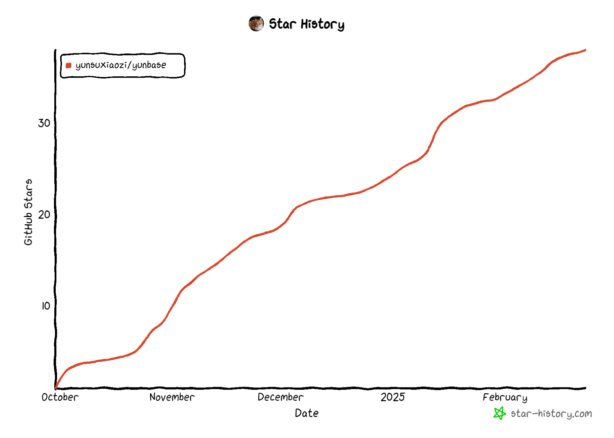

# 🚀Yunbase,first submission of your algorithm competition


In the competition of data mining,there are many operations that need to be done in every time.Many of these operations,from data preprocessing to k-fold cross validation,are repetitive.It's a bit troublesome to write repetitive code every time,so I extracted the common parts among these operations and wrote the Yunbase class here.('Yun' is my name <b>yunsuxiaozi</b>,'base' is the baseline of competition.)


### Get Started Quickly

1.git clone 

```python
!git clone https://github.com/yunsuxiaozi/Yunbase.git
```

2.download wheel in requirements.txt

```python
!pip download -r Yunbase/requirements.txt
```

3.install according to  requirements.txt

```python
!pip install -q --requirement yourpath/Yunbase/requirements.txt  \
--no-index --find-links file:yourpath
```

4.import Yunbase

```python
from Yunbase.baseline import Yunbase
```

5.create Yunbase.

All the parameters are below, and you can flexibly choose parameters according to the task.

```python
yunbase=Yunbase(num_folds:int=5,
                      n_repeats:int=1,
                      models:list[tuple]=[],
                      FE=None,
                      CV_sample=None,
                      group_col=None,
                      target_col:str='target',
                      weight_col:str='weight',
                      kfold_col:str='fold',
                      drop_cols:list[str]=[],
                      seed:int=2025,
                      objective:Literal['binary','multi_class','regression']='regression',
                      metric:str='mse',
                      nan_margin:float=0.95,
                      num_classes=None,
                      infer_size:int=10000,
                      save_oof_preds:bool=True,
                      save_test_preds:bool=True,
                      device:str='cpu',
                      one_hot_max:int=50,
                      one_hot_cols=None,
                      custom_metric=None,
                      use_optuna_find_params:int=0,
                      optuna_direction=None,
                      early_stop:int=100,
                      use_pseudo_label:bool=False,
                      use_high_corr_feat:bool=True,
                      cross_cols:list[str]=[],
                      labelencoder_cols:list[str]=[],
                      list_stat:list[tuple]=[],
                      word2vec_models:list[tuple]=[],
                      text_cols:list[str]=[],
                      plot_feature_importance:bool=False,
                      log:int=100,
                      exp_mode:bool=False,
                      use_reduce_memory:bool=False,
                      use_data_augmentation:bool=False,
                      use_oof_as_feature:bool=False,
                      use_CIR:bool=False,
                      use_median_as_pred:bool=False,
                      use_scaler:bool=False,
                      use_TTA:bool=False,
                      use_eval_metric:bool=True,
                      feats_stat:list[tuple]=[],
                      target_stat:list[tuple]=[],
                      use_spellchecker:bool=False,
                      AGGREGATIONS:list=['nunique','count','min','max','first',
                                           'last', 'mean','median','sum','std','skew',kurtosis],
                )
```

- `num_folds`:<b>int</b>.the number of folds for k-fold cross validation.

- `n_repeats`:<b>int</b>,Replace different seeds for multiple kfold cross validation.<b>This parameter is generally used for small datasets to ensure the stability of the model.</b>

- `models`:<b>list[tuple]</b>.Built in 3 GBDTs as baseline, you can also use custom models,such as 
  
  ```python
  models=[(LGBMRegressor(**lgb_params),'lgb')]
  ```
  
  
  
- `FE`:<b>function</b>.In addition to the built-in feature engineer, you can also customize feature engineer.For example:

     ```python
     def FE(df):
         return df.drop(['id'],axis=1)
     ```

​       <b>Currently, both polar and pandas are supported for writing this function.</b>


- `CV_sample`:<b>function</b>.You can customize your downsampling and oversampling operations inside.In order to ensure the accuracy of CV, operations on the validation set should not be performed in principle. However, to meet personalized needs, operations on the validation set are still allowed here In addition to sampling operations, related feature engineering can also be customized here.

  For example:

  ```python
  def CV_sample(X_train,y_train,X_valid,y_valid,
                sample_weight_train,sample_weight_valid):
      less_idx=list(np.where(y_train==1)[0])
      more_idx=list(np.where(y_train==0)[0])
      np.random.shuffle(more_idx)
      #undersample
      more_idx=more_idx[:int(len(more_idx)*0.9)]
      #Adversarial learning
      X_train_copy=X_train.iloc[less_idx].copy()
      y_train_copy=y_train.iloc[less_idx].copy()
      y_train_copy[:]=0
      sample_weight_train_copy=sample_weight_train.iloc[less_idx].copy()
      
      X_train=pd.concat((X_train.iloc[more_idx+less_idx],X_train_copy)).reset_index(drop=True)
      y_train=pd.concat((y_train.iloc[more_idx+less_idx],y_train_copy)).reset_index(drop=True)
      sample_weight_train=pd.concat((sample_weight_train.iloc[more_idx+less_idx],sample_weight_train_copy)).reset_index(drop=True)
      return X_train,y_train,X_valid,y_valid,sample_weight_train,sample_weight_valid
  ```


​      In purgedCV(time series CV), in order to make the training set and test set closer, without a validation set, this function will become as follows:

```python
def CV_sample(X_train,y_train,sample_weight_train):
    #your code
    return X_train,y_train,sample_weight_train
```


- `group_col`:<b>str</b>.if you want to use groupkfold,then define this group_col.

- `target_col`:<b>str</b>.the column that you want to predict.

- `weight_col`:<b>str</b>.You can set the weight of each sample before model training. If not defined by the user, 1 will be used by default to train each sample.

     ```python
     train['weight']=np.array([0.1,0.3,……,0.2])
     ```

     

- `kfold_col`:<b>str</b>.Allow users to customize kfold.For example,

     ```python
     num_folds=5
     train['fold']=train.index%num_folds
     ```

     

- `drop_cols`:<b>list</b>.The column to be deleted after all feature engineering is completed.

- `seed`:<b>int</b>.random seed.

- `objective`:<b>str</b>.what task do you want to do?<b>regression</b>,<b>binary</b> or <b>multi_class</b>?

- `metric`:<b>str</b>.metric to evaluate your model.

- `nan_margin`:<b>float</b>.when the proportion of missing values in a column is greater than, we delete this column.

- `num_classes`:<b>int</b>.if objectibe is <b>multi_class</b> or <b>binary</b>,you should define this parameter.

- `infer_size`:<b>int</b>.the test data might be large,we can predict in batches to deal with memory issues.

- `save_oof_preds`:<b>bool</b>.you can save OOF for your own offline study.

- `save_test_preds`:<b>bool</b>.you can save test_preds for your own offline study.                       

- `device`:<b>str</b>.GBDT can training on GPU,you can set this parameter 'gpu' when you want to training on GPU.

- `one_hot_max`:<b>int</b>.If the nunique of a column is less than a certain value, perform one hot encoder.

- `one_hot_cols`:<b>list[str]</b>.Customize which columns to use onehotencoder.

- `custom_metric`:<b>function</b>.you can define your  own custom_metric.

     ```python
     def weighted_MAE(y_true,y_pred,
                      weight=train['weight'].values):
         return np.sum(weight*np.abs(y_true-y_pred))/np.sum(weight)
     ```

     <b>1.custom_metric can only pass in the parameters y_true and y_pred. If it is a regular cross validation, it needs to be assigned a value in advance like the weight parameter above. If it is a time series CV, the use_weighted_metric parameter can be used without defining the weight parameter.</b>

     <b>2.when objective is multi_class,`y_pred` in `custom_metric(y_true,y_pred)` is probability(shape:`(len(y_true),num_classes)`).</b>

- `use_optuna_find_params`:<b>int</b>.count of use optuna find best params,0 is not use optuna to find params.<b>Currently only LGBM is supported.</b>

- `optuna_direction`:<b>str</b>.`minimize` or `maximize`,when you use custom metric,you must define the direction of optimization.

- `early_stop`:<b>int</b>.If the performance of the model does not improve multiple times, then stop training the model.

- `use_pseudo_label`:<b>bool</b>.Whether to use pseudo labels.When it is true,adding the test data to the training data and training again after obtaining the predicted results of the test data.<b>To obtain a reliable CV, the test set and cross validation training set are concatenated and validated using the validation set.</b>

- `use_high_corr_feat`:<b>bool</b>.whether to use high correlation features or not. 

- `cross_cols`:<b>list[str]</b>.Construct features using addition, subtraction, multiplication, and division brute force for these columns of features.

- `labelencoder_cols`:<b>list</b>.Convert categorical string variables into [1,2,……,n].

- `list_stat`:<b>list[tuple]=[]</b>.example:`[('step_list',list_gap=[1,2,4])]`.<b>step_list:If the data in a column is a list or str(list),
                                   such as [] or '[]', this can be used to extract diff and 
                                    shift features for list_cols.  </b>   

- `word2vec_models`:<b>list[tuple]</b>.Use models such as tfidf to extract features of string columns.For example:
  
  ```python
  word2vec_models=[(TfidfVectorizer(),col,model_name='tfidf',use_svd=False)]
  ```
  
  
  
- `text_cols`:<b>list[str]</b>.extract features of words, sentences, and paragraphs from text here.

- `plot_feature_importance`:<b>bool</b>.after model training,whether plot feature importance or not.

- `log`:<b>int</b>.How many iterators output scores on the validation set once.

- `exp_mode`:<b>bool</b>.In regression tasks, the distribution of `target_col` is a long tail distribution, and this parameter can be used to perform log transform on the target_col before training.

- `use_reduce_memory`:<b>bool</b>.<b>When facing large datasets, this function can be used to reduce memory.</b>   

- `use_data_augmentation`:<b>bool</b>.if use data augmentation,During cross validation, the training data will undergo PCA transformation followed by inverse transformation.<b>You can see function `pca_augmentation` for more details.</b>   

- `use_oof_as_feature`:<b>bool</b>.For training data, use the `oof_preds of the previous model` as the feature, and for testing data, use the predicted results of the previous model as the feature for next model.

- `use_CIR`:<b>bool</b>. use `CenteredIsotonicRegression` to fit(oof_preds,target) in the final.

- `use_median_as_pred`:<b>bool</b>.The general model ensemble uses the mean as the prediction result, and this parameter uses median as the prediction result, which sometimes achieves better results, but only slightly.

- `use_scaler`:<b>bool</b>.Although the usual scaling operation is not useful for GBDT models, after scaling the data, the clip operation can be used to remove outliers.We are using `RobustScaler` here.

- `use_TTA`:<b>bool</b>.It is to apply the previous `data augmentation` operation to the test set and then take the average of the predicted results.

- `use_eval_metric`:<b>bool</b>.Use `self.metric` to evaluate models during training with lightgbm and xgboost.

- `feats_stat`:<b>list[tuple]=[]</b>.Construct groupby features.for example: training data has some patients, testing data has other patients, each patient has multiple samples, this function can be used.

     

     ```python
     feats_stat=
     [('patient_id','year',['max','min','median','mean','std','skew',kurtosis,'(x-mean)/std','max-min','mean/std'])]
     ```

- `target_stat`:<b>list[tuple]=[]</b>.For example, if you have counted 100000 male and female samples and found that the average height of males is 168 and females is 166, then you can use `{'male':168,'female':166} `as a new feature of sex.`target_stat=[('sex','height',['mean'])] `.

     The effect of binary variables may not be significant, but multivariate categorical variables can demonstrate the size relationship between variables in this way.

     <b>Common aggregation features can be directly called using strings, while custom aggregation features need to be implemented through functions.Currently only supports polars.</b>

     ```python
     STATS=['min','mean','std','max','median','sum','skew','count','nunique']
     
     def qp(percentage):
         def q(x):
             x=x.to_numpy()
             return np.percentile(x,percentage)
         return q
     [('q0',qp(0.05)),('q1',qp(0.25)),('q3',qp(0.75)),('q4',qp(0.95))]
     ```

     


- `use_spellchecker`:<b>bool</b>.This is an immature feature that checks for word errors in text and then makes corrections. The main issue is that it takes too long time.
- `AGGREGATIONS:list=['nunique','count','min','max','first',
      'last', 'mean','median','sum','std','skew',kurtosis]`.


6.yunbase training

At present, it supports read csv, parquet files according to path, or csv files that have already been read.

```python
yunbase.fit(train_path_or_file:str|pd.DataFrame|pl.DataFrame='train.csv',
            category_cols:list[str]=[],date_cols:list[str]=[],
            target2idx:dict|None=None,pseudo_label_weight:float=0.5,
            save_trained_models:bool=True,
           )
```

- `train_path_or_file`:You can use the file path or pass in the already loaded file.
- `category_cols`:You can specify which columns to convert to 'category' in the training data.
- `date_cols`:If a column of features are all of time type, for example :"2024-04-23",this can be used to construct features.
- `target2idx`:The dictionary mapped in the classification task, if you want to predict a person's gender, you can specify `{'Male ': 0,' Female ': 1}`.If you do not specify it yourself, it will be mapped to 0, 1,... n in order of the number of times each target appears.
- `pseudo_label_weight`:When using pseudo labels to train a model, the weight of the test data compared to the training data.For example, if the weight of the training data is 2 and set to 0.5, the test data will use 1 as the weight to train the model.
- `save_trained_models`:Do you want to save the models generated during the training process. Note that if you need to separate training and inference, you only need to save the yunbase object, and do not need to save the models generated in between.

7.yunbase inference

```python
test_preds=yunbase.predict(test_path_or_file:str|pd.DataFrame|pl.DataFrame='test.csv',weights=np.zeros(0))
test_preds=yunbase.predict_proba(test_path_or_file:str|pd.DataFrame|pl.DataFrame='test.csv',weights=np.zeros(0))
```

- `weights`:This is setting the weights for model ensemble. For example, if you specify lgb, xgb, and cat, you can set weights to [3,4,3].There will be functions internally that normalize and integrate the weights.

8.save test_preds to submission.csv

```python
yunbase.submit(submission_path_or_file='submission.csv',test_preds=np.ones(3),save_name='yunbase')
```

- `save_name` .if you set  'submission',it will give you a csv file named `submission.csv`.

9.ensemble

```python
yunbase.ensemble(solution_paths_or_files:list[str]=[],id_col:str='id',target_col:str='',weights=None)
```

- For example:

  ```python
  solution_paths_or_files=[
  'submission1.csv',
  'submission2.csv',
  'submission3.csv'
  ]
  weights=[3,3,4]
  ```

10.If train and inference need to be separated.

```python
#model save
yunbase.pickle_dump(yunbase,'yunbase.model')

import dill#serialize and deserialize objects (such as saving and loading tree models)
def pickle_load(path):
    #open path,binary read
    with open(path, mode="rb") as f:
        data = dill.load(f)
        return data
yunbase=Yunbase()
yunbase=pickle_load("yunbase.model")
yunbase.model_save_path=your_model_save_path
```

11.train data and test data can be seen as below.

```python
yunbase.train.head(),yunbase.test.head()
```

##### <a href="https://www.kaggle.com/code/yunsuxiaozi/yunbase">Here</a> is a static version that can be used to play Kaggle competition.You can refer to this <a href="https://www.kaggle.com/code/yunsuxiaozi/brist1d-top5-solution">notebook</a> to learn usage of Yunbase. 

## TimeSeries Purged CV

```python
yunbase.purged_cross_validation(self,train_path_or_file:str|pd.DataFrame|pl.DataFrame='train.csv',
                                test_path_or_file:str|pd.DataFrame|pl.DataFrame='test.csv',
                                date_col:str='date',train_gap_each_fold:int=31,#one month
                                train_test_gap:int=7,#a week
                                train_date_range:int=0,test_date_range:int=0,
                                category_cols:list[str]=[],
                                use_seasonal_features:bool=True,
                                use_weighted_metric:bool=False,
                                only_inference:bool=False,
                                timestep:str='day',
                                target2idx:dict|None=None,
                                save_trained_models:bool=True,
                               )
```

- `only_inference`:If you don't want to see the offline scores of the time-series CV or want to save time, you can directly train the final submitted model.

Demo notebook:<a href="https://www.kaggle.com/code/yunsuxiaozi/rsfc-yunbase">Rohlik Yunbase</a>


## Adversarial Validation

<a href='https://www.kaggle.com/code/yunsuxiaozi/spfdp-yunbase'>Demo notebook</a>

### follow-up work

The code has now completed a rough framework and will continue to be improved by adding new functions based on bug fixes.

<b>In principle, fix as many bugs as I discover and add as many new features as I think of.</b>

1.fit function to `np.array`.(such as `model.fit(train_X,train_y)`

`model.predict(test_X)`).

2.add more common `metric`.

3.In addition to kfold, `single model` training and inference are also implemented.

4.hill climbing to find `blending` weight.

5.Optimize `memory` and `time` to cope with larger datasets.`(pandas->polars)`

6.Make the code more beautiful, concise, and easy to understand.

7.Add statements with abnormal `error messages`.

Waiting for updates.

Kaggle:https://www.kaggle.com/yunsuxiaozi



## Some interesting dataset recommendations:

#### 1.Competitions with significant differences in data distribution between training and testing sets: suitable for learning adversarial validation: <a href="https://www.kaggle.com/competitions/should-i-eat-this-mushroom-tfug-delhi/overview">Should I eat this mushroom? TFUG Delhi</a>

#### 2.Treat regression tasks as classification tasks:<a href="https://www.kaggle.com/competitions/playground-series-s3e25/overview">Regression with a Mohs Hardness Dataset</a>

#### 3.Treat classification tasks as regression tasks:<a href="https://www.kaggle.com/competitions/child-mind-institute-problematic-internet-use/overview">Child Mind Institute — Problematic Internet Use</a>

#### 4.A dataset with almost noise and only weak signals can be used to learn TargetEncoder.<a href="https://www.kaggle.com/competitions/playground-series-s5e2/overview">Backpack Prediction Challenge</a>


Due to the large amount of content in the README, there may still be some errors even after updating,`baseline.py` and `README.md` may not synchronize updates. 

<b>update time:2025/03/27</b>

